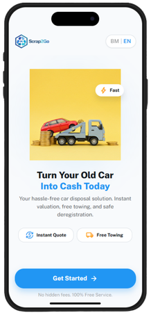
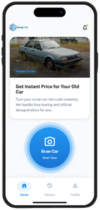
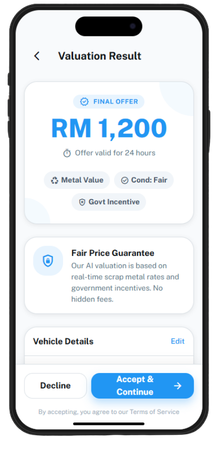

# Scrap2Go

_Turn your old car into cash today - The first screen users see when opening Scrap2Go_

## Overview

Scrap2Go is a comprehensive digital platform designed to revolutionize the scrap vehicle disposal process in Malaysia. The application serves as an end-to-end solution that connects vehicle owners with authorized scrap dealers, streamlining the entire journey from vehicle valuation to official deregistration with the Road Transport Department of Malaysia (JPJ - Jabatan Pengangkutan Jalan).

## Purpose

The primary purpose of Scrap2Go is to simplify and modernize what has traditionally been a complex, time-consuming, and often opaque process of scrapping end-of-life vehicles. The platform addresses several pain points in the traditional scrap vehicle market by providing transparency, convenience, and legal compliance throughout the entire disposal process.

## Core Concept

Scrap2Go operates on a mobile-first approach, offering users a seamless experience through their smartphones. The platform guides users through every step of the vehicle disposal journey, from initial registration to final payout, eliminating the need for physical visits to multiple locations or dealing with confusing paperwork.

### The Journey

**1. User Onboarding**
Users begin their journey by creating an account through a simple registration process. The platform supports multiple authentication methods including PIN and password protection, ensuring secure access to sensitive information and transactions.

_Home Dashboard - Your command center for all scrap vehicle activities with active orders and quick scan access_

**2. Vehicle Assessment**
The heart of the service lies in its AI-powered vehicle valuation system. Users are guided through a photo documentation process where they capture images of their vehicle from multiple angles. The platform provides clear guidance on how to photograph the vehicle for optimal assessment, ensuring accurate valuations based on:

- Vehicle condition
- Metal value
- Make and model
- Age and mileage
- Government incentives for proper disposal

_Valuation Result - Transparent pricing with clear breakdown of offer components and 24-hour validity_

**3. Instant Valuation**
Within moments of submitting vehicle photos and details, users receive a transparent, competitive offer for their vehicle. The platform guarantees fair pricing based on current scrap metal rates, vehicle condition, and applicable government incentive programs. Each offer comes with a validity period, typically 24 hours, giving users time to make an informed decision.

**4. Scheduling & Location Services**
Once users accept an offer, they can schedule a convenient pickup time and location. The platform includes features for:

- Selecting pickup addresses
- Saving frequently used addresses
- Choosing preferred time slots
- Receiving notifications about pickup status

**5. Driver Coordination & Inspection**
On the scheduled day, a certified driver arrives to collect the vehicle. The platform facilitates real-time tracking of the tow truck, allowing users to monitor the driver's arrival. Upon arrival, the driver conducts a comprehensive inspection to verify:

- Engine presence
  
  _Live Tracking - Real-time map showing driver location and estimated arrival time_

- Catalytic converter status
- Overall condition matching the submitted photos

**6. Legal Documentation & Ownership Transfer**
A critical feature of Scrap2Go is its handling of legal documentation. The platform includes:

- Digital signature capabilities for ownership transfer
- Consent forms for vehicle disposal
- Terms and conditions acknowledgment
- Documentation preview before finalization

This ensures that the ownership transfer is legally binding and properly documented, protecting both the seller and the buyer.

**7. Official JPJ Deregistration**
One of the most valuable services Scrap2Go provides is handling the official vehicle deregistration with JPJ. This eliminates a major hassle for vehicle owners who would otherwise need to:

- Navigate complex government procedures
- Visit JPJ offices in person
- Handle physical paperwork
- Follow up on deregistration status

The platform manages this entire process on behalf of the user, providing updates at each stage and delivering official deregistration certificates upon completion.

**8. Payment & Payout**
Users receive their payment through their chosen method after successful vehicle collection and inspection. The platform supports:

_Payment Success - Celebration screen confirming payment sent with transaction details and downloadable receipts_

- Bank account transfers
- Multiple payment methods
- Payout confirmation screens
- Digital receipts for record-keeping

## Key Features

### For Vehicle Owners

- **Instant Quotes**: Get immediate, fair-market valuations without haggling
- **Free Towing**: No cost for vehicle pickup and transportation
- **JPJ Deregistration**: Complete handling of official government paperwork
- **Transparent Pricing**: Clear breakdown of valuation factors
- **Secure Payments**: Safe, direct bank transfers
- **Order Tracking**: Real-time updates from submission to completion
- **Transaction History**: Complete records of all past transactions
- **Multi-language Support**: Service available in Bahasa Malaysia and English

### Identity & Verification

The platform includes robust identity verification features to ensure security and compliance with regulations, including document upload capabilities and identity verification processes.

### Support & Assistance

Users have access to:

- Comprehensive help center
- Direct customer support contact
- Frequently asked questions
- Privacy policy and terms of service
- Referral program for rewarding users who bring new customers

### User Experience Features

- **Dark/Light Mode**: Appearance settings for user comfort
- **Notifications**: Real-time updates on order status
- **Profile Management**: Complete control over account settings
- **Rating System**: Ability to rate service quality
- **Gallery & Camera Integration**: Seamless photo capture and upload

## Target Audience

Scrap2Go is designed for:

- Individual vehicle owners looking to dispose of old, damaged, or end-of-life vehicles
- Families inheriting vehicles that are no longer roadworthy
- Businesses managing fleet vehicle disposal
- Anyone seeking a hassle-free, legally compliant way to scrap their vehicle while receiving fair compensation

## Environmental & Social Impact

Beyond convenience, Scrap2Go contributes to environmental sustainability by:

- Ensuring proper disposal of vehicles through authorized channels
- Facilitating recycling of valuable materials
- Preventing illegal dumping of end-of-life vehicles
- Supporting government initiatives for vehicle deregistration and environmental compliance

## The Scrap2Go Advantage

What sets Scrap2Go apart is its comprehensive approach:

- **One-Stop Solution**: Everything from valuation to deregistration in one platform
- **Transparency**: No hidden fees or surprise deductions
- **Convenience**: Complete the entire process from home
- **Legal Compliance**: Full handling of JPJ requirements
- **Speed**: Quick turnaround from submission to payout
- **Trust**: Certified drivers and authorized disposal facilities
- **Technology-Driven**: Modern approach to a traditionally analog process

## Vision

Scrap2Go envisions a future where disposing of end-of-life vehicles is as simple as ordering a ride-share service. By combining technology, regulatory compliance, and customer-centric design, the platform aims to become Malaysia's leading digital marketplace for vehicle scrapping, setting new standards for transparency, efficiency, and user satisfaction in the automotive recycling industry.
